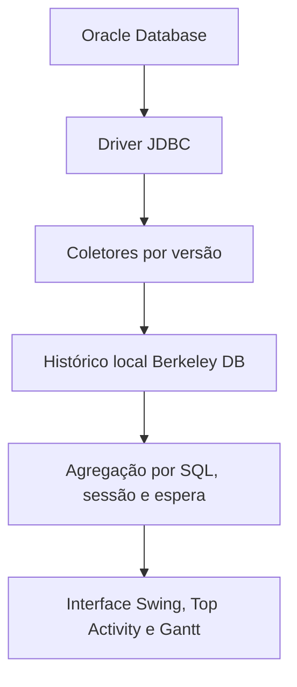

# Arquitetura

## Organização

Na branch SQL Server, `org.ash.activity.ActivityRepository` define um contrato
de leitura independente de Oracle. `org.ash.sqlserver` contém o adaptador JDBC
e a tela experimental; `sqlserver/` contém o schema e os procedimentos de
coleta/expurgo executados no servidor. A implementação não converte amostras de
um minuto em ASH Oracle de um segundo e não grava esses dados no Berkeley DB
legado. Consulte [SQL Server](SQLSERVER.md) para o fluxo, limites e evolução.

| Caminho | Responsabilidade |
| --- | --- |
| `src/org/ash/MainApp.java` | Entrada da aplicação |
| `src/org/ash/conn` | Interface de perfis, conexão e pool JDBC |
| `src/org/ash/database` | Coleta Oracle e persistência |
| `src/org/ash/datamodel` | Entidades e índices Berkeley DB |
| `src/org/ash/datatemp` | Agregações temporárias |
| `src/org/ash/gui`, `detail`, `history` | Interface online e histórica |
| `src/org/ash/invoker` | Agendamento dos coletores |
| `src/org/ash/explainplanmodel` | Modelos de planos de execução |
| `src/org/ash/util` | Dicionários e opções |
| `third-party/src` | Fontes adaptados das bibliotecas incorporadas |
| `third-party/maven` | Dependência legada ausente do Maven Central |
| `tests` | Testes automatizados e integração opcional |

O Maven compila o código da aplicação e os fontes adaptados juntos porque há dependências circulares históricas: por exemplo, `org.jfree.chart.ChartPanel` referencia classes `org.ash`, assim como `GradientColorModule` do E-Gantt. A separação física torna a origem explícita, mas não afirma independência modular. Substituir essas bibliotecas por JARs oficiais exigirá extrair as adaptações para extensões próprias e validar os gráficos.

A seleção do coletor usa `DatabaseMetaData.getDatabaseMajorVersion()` e `getDatabaseMinorVersion()`. Oracle 11 ou posterior segue o coletor existente `Database11g1`; isso é uma estratégia de compatibilidade a validar, não uma certificação. O coletor usa agora `ResultSet.getTimestamp` para preservar milissegundos e evitar casts Oracle nessas datas.

O armazenamento permanece no formato existente. Nunca abra simultaneamente a mesma pasta Berkeley DB por duas instâncias ou por versões diferentes.
