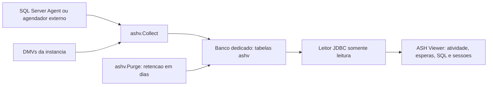

# SQL Server: histórico de sessões (experimental)

Desenvolvimento na branch `feature/sqlserver-session-history`. O alvo inicial é
SQL Server **2012 ou posterior**, em uma instância tradicional Windows/Linux.
Compatibilidade é uma meta de implementação: ainda não houve homologação em
instância real, incluindo conexão TLS, DMVs, scripts e jobs. Azure SQL Database,
Synapse e Fabric não estão incluídos neste primeiro recorte.

## Fluxo



A coleta continua com o ASH Viewer fechado. Um banco de monitoramento guarda o
histórico da própria instância. A aplicação só consulta esse repositório; a
instalação e o agendamento são executados pelo DBA. Não instale um coletor por
banco de aplicação, pois cada execução já observa as requisições de usuário da
instância inteira.

## O que é medido

Cada execução grava uma amostra em UTC, mesmo sem requisições ativas. As linhas
detalhadas vêm de `sys.dm_exec_requests` com `sys.dm_exec_sessions`, excluindo a
própria conexão coletora e sessões internas. Incluem banco, login, host,
programa, estado, espera, bloqueador, CPU e leituras acumuladas da requisição,
hash de consulta e, opcionalmente, texto SQL limitado a 2000 caracteres.

Uma sessão pode ter várias requisições. A chave é amostra + sessão + request;
os rankings de sessão também consideram `login_time` para reduzir confusão por
reutilização de IDs. `login_time` e início da requisição preservam a hora local
original do SQL Server; o horário da coleta é sempre UTC.

O padrão é **uma fotografia por minuto**, não um registro de tudo que aconteceu
durante o minuto. Consultas curtas podem não aparecer. Rankings contam
observações de requisições; não representam duração exata nem somam CPU
acumulada como se fosse consumo de cada intervalo. Estados sem espera não são
automaticamente classificados como CPU. Hashes podem ser ausentes ou colidir.
O gráfico usa pontos, sem preencher lacunas; uma coleta vazia é diferente de
uma coleta ausente. Bloqueadores inativos podem aparecer pelo ID sem detalhes
próprios nesta versão.

## Instalação

Use um banco dedicado existente, por exemplo `AshViewer`, criado pelo DBA com
limites e crescimento de arquivos adequados. Execute os arquivos com `sqlcmd`
ou SSMS em **SQLCMD Mode**, pois usam `:ON ERROR EXIT` e separadores `GO`.

```powershell
# Autenticacao Windows; ajuste servidor, porta e banco.
sqlcmd -S localhost,1433 -E -d AshViewer -b -i sqlserver/install.sql
sqlcmd -S localhost,1433 -E -d AshViewer -b -i sqlserver/agent-job.sql
```

O instalador cria o schema, configuração, tabelas, índices, procedimentos e a
role de leitura. Reexecutá-lo preserva tabelas e configuração e atualiza os
procedimentos da versão 1; não é um mecanismo geral de migração de schema.
Não usa `CREATE OR ALTER`, indisponível no SQL Server 2012.

O script de jobs exige SQL Server Agent disponível e em execução. Cria
`ASHV Collect - <banco>` a cada minuto e `ASHV Purge - <banco>` a cada hora.
Recusa substituir jobs existentes. Revise o proprietário dos jobs e seu
contexto de execução; acompanhe falhas no histórico do Agent. O job de expurgo
funciona independentemente do sucesso da coleta.

SQL Server Express não tem Agent: agende externamente `EXEC ashv.Collect;`
a cada minuto e `EXEC ashv.Purge;` a cada hora, por exemplo com `sqlcmd -b` e o
Agendador de Tarefas. O coletor usa lock de aplicação para recusar execuções
simultâneas; a aplicação desktop não substitui o agendador.

## Permissões

O instalador deve ser executado por administrador autorizado a criar objetos;
o script de jobs requer acesso administrativo ao Agent/msdb. O contexto que
executa a coleta precisa de `VIEW SERVER STATE` no SQL Server 2012–2019 ou
`VIEW SERVER PERFORMANCE STATE` no SQL Server 2022+, além de `EXECUTE` no
procedimento. O expurgo precisa de `EXECUTE` em `ashv.Purge`. Use esses
procedimentos sob propriedade comum `dbo`, sem conceder escrita direta ao
usuário da aplicação. Não habilite `TRUSTWORTHY` para esta solução.

Para um login de leitura já criado, no banco de monitoramento:

```sql
CREATE USER ashv_reader_login FOR LOGIN ashv_reader_login;
ALTER ROLE ashv_reader ADD MEMBER ashv_reader_login;
```

A role concede `SELECT` no schema `ashv`; o leitor não necessita de acesso às
DMVs, de sysadmin ou de permissão para criar jobs. Texto SQL pode conter dados
sensíveis: sua captura vem desligada. A opção TLS da tela valida o certificado
por padrão. A exceção de confiança explícita destina-se ao laboratório.
Instâncias antigas precisam de configuração/atualizações TLS compatíveis com
Java 17 e o driver JDBC; não se desativa criptografia para contornar isso.

## Frequência, retenção e espaço

Frequência e retenção são configurações independentes. Antes de criar o job,
altere `@interval_minutes` (1 a 59) em `agent-job.sql`; depois, altere o schedule
no Agent. No repositório:

```sql
UPDATE ashv.Configuration SET retention_days = 30 WHERE id = 1;
-- Opcional: texto SQL, limitado a 2000 caracteres por observacao.
UPDATE ashv.Configuration SET capture_sql_text = 1 WHERE id = 1;
```

Trinta dias são uma janela móvel de 30 × 24 horas, não um mês de calendário.
`ashv.Purge` remove amostras com data estritamente anterior ao corte UTC,
incluindo detalhes em cascata. Por execução, processa no máximo 100 lotes de
100 amostras. Cada lote é uma transação independente quando executado pelo job;
a quantidade de detalhes depende da atividade em cada amostra. Um atraso
grande pode exigir várias execuções ou limites maiores (até 1000 por parâmetro).
A limpeza horária permite dados vencidos por até uma hora, além de eventuais
atrasos ou falhas do job.

Retenção temporal não é uma quota de armazenamento: monitore espaço, log,
duração do expurgo e sucesso dos jobs. Como estimativa, 100 requisições por
coleta × 1440 coletas/dia × 30 dias = **4,32 milhões de detalhes**, mais índices
e texto SQL quando habilitado. Excluir linhas libera espaço para reutilização;
não reduz automaticamente o arquivo físico e não há shrink automático.

## Consultar no ASH Viewer

```powershell
mvn clean verify
.\run.bat --sqlserver
```

No Linux/macOS: `sh run.sh --sqlserver`. Também existe a entrada
**SQL Server (experimental)** no menu File da janela principal.
Informe host, porta TCP, banco do repositório, login SQL e senha. Esta primeira
tela usa autenticação SQL; não persiste perfis nem senhas. A senha é limpa após
cada consulta. Use datas ISO UTC, como `2026-09-23T12:00:00Z`, ou **Última hora**,
e clique em **Consultar histórico**. A atualização é manual nesta versão.

A tela mostra atividade por coleta, top 20 esperas/estados, top 20 SQL por
banco/hash, top 20 sessões e até 1000 detalhes mais recentes (com aviso de
limite). Os rankings abrangem o intervalo inteiro. Intervalos têm início
inclusivo e fim exclusivo, limite de 31 dias e de 50000 amostras; cada consulta
JDBC tem timeout de 30 segundos. Consultas sucessivas podem observar expurgos
concorrentes; o relatório não é uma fotografia transacional única.

## Validação e evolução

Os testes Java usam JDBC simulado para verificar limites, UTC, encerramento de
recursos, compatibilidade de schema e separação de credenciais. A suíte Oracle
continua fazendo parte do build. Não equivalem a testes de integração SQL.

Validação local em 23/09/2026: Windows, JDK 17 e Maven 3.9.16, **31 testes
aprovados, sem falhas ou testes ignorados**, incluindo oito testes novos do
módulo SQL Server. O gráfico foi renderizado em teste headless; a janela
completa ainda requer inspeção interativa. O pacote inclui o driver Microsoft
JDBC `12.8.2.jre11`. Não havia `sqlcmd` nem Docker disponíveis para executar os
scripts SQL neste ambiente.

O `mvn clean verify` também passou em uma cópia isolada dos mesmos fontes em
`.tools/sqlserver-validation`, com o cache Maven local. Essa cópia foi usada
porque a limpeza do `target/lib` principal encontrou um JAR bloqueado. O pacote
limpo contém somente a versão `12.8.2.jre11` do driver Microsoft.

Em um **repositório de teste isolado**, depois da instalação:

```powershell
sqlcmd -S localhost,1433 -E -d AshViewer -b -i sqlserver/verify.sql
```

Esse roteiro valida heartbeat, contagem de detalhes e expurgo com cascata,
desfazendo alterações ao final (valores IDENTITY podem avançar). Teste também
carga longa, bloqueio entre sessões, falta de permissões, concorrência de
coletores, reinício do Agent, janela vazia e leitura com a role restrita.
Execute primeiro em SQL Server 2012 e repita nas versões disponíveis, incluindo
2022+ pela mudança de permissões. Registre versão/build, resultados e custos.

`ActivityRepository` define o contrato de leitura e os dados da nova tela;
`SqlServerRepository` implementa as consultas específicas. Outros bancos podem
implementar esse contrato sem emular views Oracle. O caminho Oracle continua
usando seus coletores e Berkeley DB. Esta etapa ainda não oferece paridade com
planos Oracle, ASH reports, trace, perfis persistentes, modo offline SQL Server
ou todos os gráficos legados. A unificação dessas funções deve respeitar as
capacidades e a resolução temporal de cada fonte.

## Referências

- [DMV de requisições e permissões](https://learn.microsoft.com/en-us/sql/relational-databases/system-dynamic-management-views/sys-dm-exec-requests-transact-sql?view=sql-server-ver17)
- [DMV de sessões](https://learn.microsoft.com/en-us/sql/relational-databases/system-dynamic-management-views/sys-dm-exec-sessions-transact-sql?view=sql-server-ver17)
- [Agendamento do SQL Server Agent](https://learn.microsoft.com/en-us/sql/relational-databases/system-stored-procedures/sp-add-schedule-transact-sql?view=sql-server-ver17)
- [Agendamento externo no Express](https://learn.microsoft.com/en-us/troubleshoot/sql/database-engine/backup-restore/schedule-automate-backup-database)
- [Matriz do driver JDBC Microsoft](https://learn.microsoft.com/en-us/sql/connect/jdbc/microsoft-jdbc-driver-for-sql-server-support-matrix?view=sql-server-ver17)
